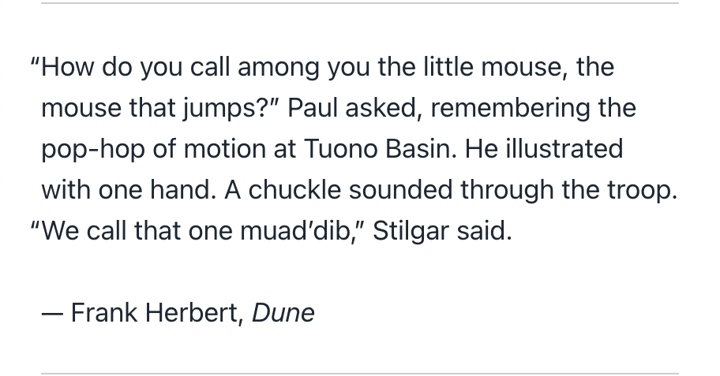

# hanging-punctuation.lua

A [lua filter] for [Pandoc], which allows curly quotes to hang into the margin.



<!-- TODO(jez) Add a page to pandoc-markdown-css-theme advertising this -->

[lua filter]: https://pandoc.org/lua-filters.html
[Pandoc]: https://pandoc.org

For usage instructions, see the website:

→ <https://jez.io/pandoc-hanging-punctuation/>

## Developing

Testing changes:

```bash
# Regenerate index.html:
make
```

Assorted commands to build the website:

```bash
# One-time setup
brew install pandoc-sidenote
(cd website && bundle install)

# Preview the site
(cd website && _bin/serve)

# New posts/pages
bundle exec octopress new draft my-slug
bundle exec octopress new page

# Rebuilding the site
(cd website && _bin/publish)
```

## License

[](https://jez.io/blueoak-license/)

Blue Oak Model License, Version 1.0.0
